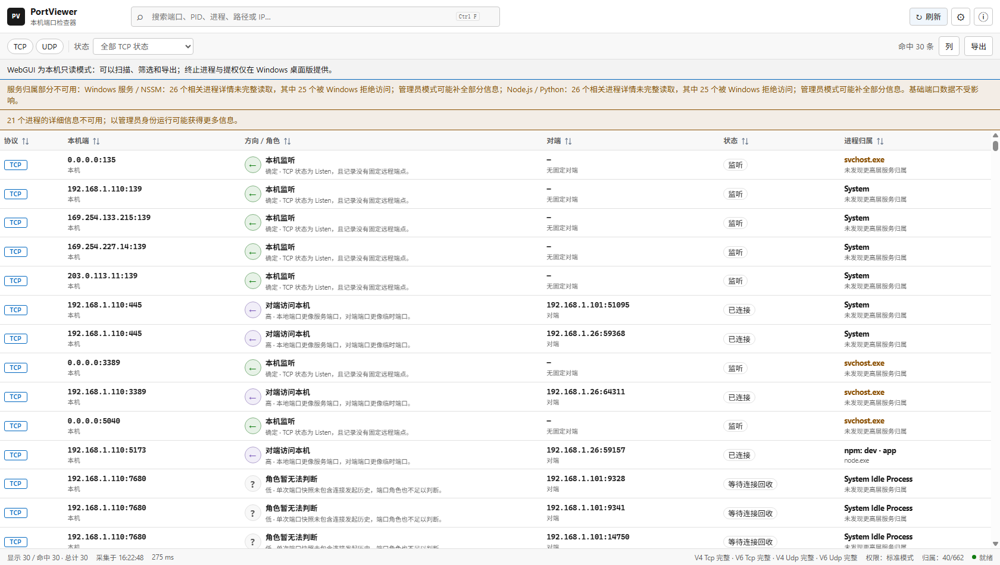
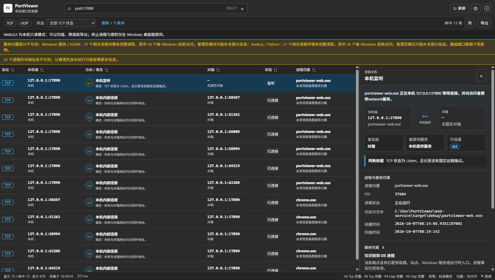

<div align="center">

# PortViewer

**Find which port is whose — and which are still free — without touching a terminal.**

[](https://github.com/your-username/PortViewer/actions/workflows/ci.yml)
[](https://github.com/your-username/PortViewer/actions/workflows/release.yml)


[English](README.md) | [简体中文](README.zh-CN.md)

</div>

---

Servers collect services — databases, admin panels, reverse proxies, automation scripts — and sooner or later nobody remembers whether port 8080 belongs to the wiki or the API, or which port is still free for the next deployment. PortViewer is built for exactly that moment.

It reads native TCP/UDP endpoints (IPv4/IPv6) on Windows and Linux and attributes every listener to the owning process, Windows service, Docker container, Nginx site or IIS application pool — searchable, filterable and exportable in a clean GUI, no `netstat`/`ss`/`lsof` required. It doubles as a fast evidence tool for developers, desktop admins and support engineers: locate what holds a port in seconds, copy diagnostics, and (desktop edition only) terminate the offending process safely after identity re-verification.

The desktop app has **no accounts, no backend services and no telemetry** — it does not touch the network by default, and scan results live only in process memory. An optional bundled **web-service** adds a read-only WebGUI plus an explicitly-enabled, LAN-only, token-authenticated port-query API with CLI and MCP support: ask a host "is this port taken?" — anonymous calls get a yes/no answer, token holders get full attribution, and agents can request a currently bindable free port.

| Light | Dark |
|:---:|:---:|
|  |  |

## Features

- **Full endpoint visibility** — TCP connections, TCP listeners and UDP endpoints for IPv4/IPv6, with state, PID, process name, path and creation time.
- **Workload attribution** — map ports to Docker containers (container name, image, Compose project/service), Nginx `server_name` + config source, IIS sites and app pools, Windows services, NSSM, npm/Node.js entrypoints and Python scripts/modules, using native parent chains and SCM.
- **Search that understands ports** — plain text plus field syntax: `port:`, `pid:`, `process:`, `service:`, `owner:`, `workload:`, `ip:`, `state:`, `protocol:`.
- **Filter, sort, customize** — protocol and TCP-state filters, multi-column sorting, visible-column selection, light/dark/system themes, three density levels.
- **Live + safe refresh** — single-shot and auto refresh (pauses while the window is hidden), keeps the last good snapshot on scan failure.
- **Evidence-grade export** — CSV (UTF-8 BOM, RFC 4180, formula-injection protection) and JSON of the full filtered/sorted view via the native save dialog.
- **Guarded process termination** — desktop only; the backend re-verifies PID + creation time and refuses system-critical or ambiguous targets. See [Safety by design](#safety-by-design).
- **LAN port-query API, CLI and MCP** — ask a deployed host whether specific ports are in use; anonymous calls get a yes/no, bearer tokens get full listener details, and agents can request a random free bindable port above `30001`.

## Install

Grab the latest artifacts from [Releases](https://github.com/your-username/PortViewer/releases):

| Artifact | What it is |
|---|---|
| `PortViewer-windows-x64-setup.exe` | Desktop app, online NSIS installer (downloads WebView2 if missing) |
| Offline MSI | Desktop app with bundled WebView2 Runtime, fully offline |
| `PortViewer-WebGUI-*.zip` | Read-only WebGUI service (Windows and Linux builds) |

Requirements: Windows 10/11 x64 with the [Microsoft Edge WebView2 Runtime](https://developer.microsoft.com/microsoft-edge/webview2/) (preinstalled on supported systems). The WebGUI additionally runs on Linux. Every release ships a SHA-256 manifest.

## Build from source

Prerequisites: Node.js 22 + npm, Rust stable (`x86_64-pc-windows-msvc`), Visual Studio 2022 Build Tools with "Desktop development with C++" and the Windows SDK.

```powershell
git clone https://github.com/your-username/PortViewer.git
cd PortViewer
npm ci

# Desktop app (dev mode)
npm run tauri dev

# Portable release exe
npm run build:desktop

# Installers (online NSIS / offline MSI)
npm run build:installer
npm run build:installer:offline
```

WebGUI (Windows/Linux, read-only):

```bash
npm ci
npm run build
cargo run --release --manifest-path web-service/Cargo.toml -- --assets dist
# open http://127.0.0.1:17890
```

LAN port API (API-only, opt-in):

```powershell
$env:PORTVIEWER_API_TOKEN = '<at least 32 bytes of random token>'
cargo run --release --manifest-path web-service/Cargo.toml -- serve --api-only --listen 0.0.0.0:17890
```

Quality gates: `npm test`, `npm run typecheck`, `npm run build`, plus `cargo fmt --check` / `cargo test` / `cargo clippy -D warnings` in `src-tauri` and `web-service` — the same set CI enforces on every push. Never build releases with a bare `cargo build --release`; production builds must enable the Tauri `custom-protocol` feature (the build scripts fail closed otherwise).

## Safety by design

- **Termination is treated as irreversible.** The UI only unlocks it after reading a non-empty process creation time; the Rust backend then re-reads the process identity and rejects PID reuse, PID 0/4, PortViewer itself, Windows-critical processes and insufficient-permission cases. PortViewer never bypasses the Windows permission model.
- **The web surface is read-only by default.** The WebGUI listens on loopback only; non-loopback mode exposes just `/health` and the port API, requires a strong token, rejects cross-site origins and non-local `Host` headers, and never exposes termination or elevation. Sensitive deployments should use an isolated management network or an HTTPS reverse proxy.
- **Frontend/backend build binding.** Four verification layers (embedded `dist` via `custom-protocol`, config integrity, source + `dist` SHA-256 manifests re-checked by `build.rs`, and a runtime identity handshake) ensure the shipped backend only loads this repository's frontend.
- **Data stays local.** Scans live in process memory only; exports get anti-formula-injection escaping and truncation markers.

## Documentation

| Document | Language |
|---|---|
| [中文 README（详细版）](README.zh-CN.md) | 简体中文 |
| [LAN port API, CLI & MCP guide](docs/lan-port-api.md) | 中文 |
| [OpenAPI spec](docs/api/portviewer-lan.openapi.yaml) | — |
| [WebGUI deployment](docs/webgui-deployment.md) | 中文 |
| [Windows installation & dependencies](docs/installation.md) | 中文 |

## Non-goals

No packet capture, protocol parsing, traffic statistics, firewall management, malware verdicts, scanning of arbitrary public hosts, history/trending, alerts, tray/auto-start, accounts, cloud sync or team features. LAN capabilities only query hosts where PortViewer's service is deliberately deployed — no subnet discovery. PortViewer reports system facts; it does not replace TCPView, Wireshark, EDR or Task Manager. Linux WebGUI is first-release quality: port/process facts are solid, but advanced attribution (Docker/systemd/Nginx) trails the Windows edition.

## Contributing

Issues and pull requests are welcome — see [CONTRIBUTING.md](CONTRIBUTING.md) and [CODE_OF_CONDUCT.md](CODE_OF_CONDUCT.md). Bug reports use the [issue template](.github/ISSUE_TEMPLATE/bug_report.yml).

## Security

Found a security issue? Please follow the responsible-disclosure policy in [SECURITY.md](SECURITY.md) — do not open a public issue.

## License

[MIT](LICENSE) © PortViewer contributors. Desktop UI built with [Vue 3](https://vuejs.org/), [PrimeVue](https://primevue.org/) and [Tauri 2](https://v2.tauri.app/); web service in Rust.
